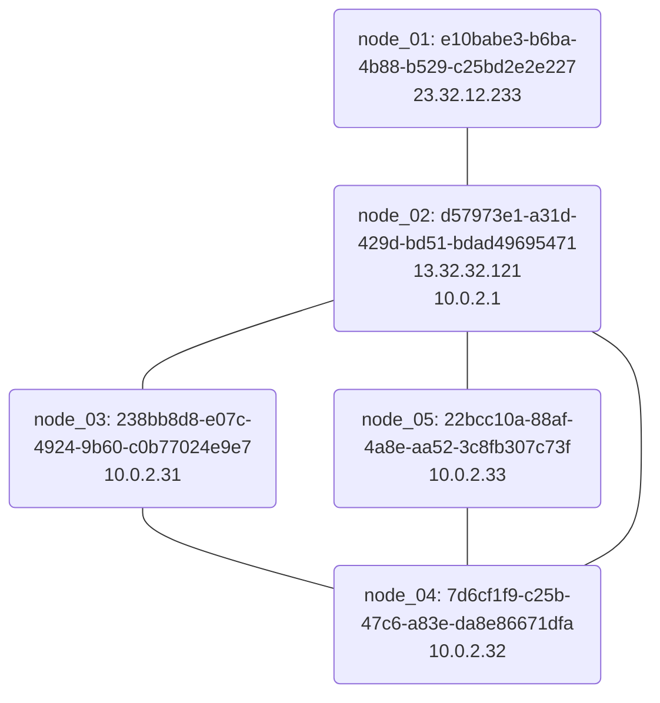

# Concept of Districe

## Nodes

Each instance of Districe is called a `Node`.

They each has a `UUID` and a `NodeName`.

Here is a simple graph shows how they connects.



## Service Routing

Districe combines `registry`, `bridge`, `base` and other services into one server.

Routing is done with a middleware. It’ll identify registry with the first package.

```plain
service=[SERVICE_NAME]
```

`SERVICE_NAME` can be `registry`, `bridge`, `base` or other things.

## Registries

### Definition

A `Registry` is a place which is similar to a tracker. It tells the nodes where to discover new nodes. A `node` itself can be used as a `registry`.

### Registry Protocol

The current version number is `1.0`.

#### Connection

A TCP connection should be established. TLS is better.

The connection will be short. It will be closed after querying.

We should use `\r\n`(CRLF) instead of `\r` and `\n`.

#### Hand-Shaking

The client side should send the following message first in one packet:

```plain
service=registry
```

And the server side should reply:

```plain
200 DISTRICE REGISTRY SERVER 0.1.0-alpha
```

`0.1.0-alpha` should be the version of the server software.

#### Instructions

> Note: S> stands for Server-side message, C> stands for Client-side message.

##### Ping

```plain
C> PING
S> 201 PONG
```

##### Random

Returns known nodes in random order.

Parameters: one in total: number.

```plain
C> RANDOM 3
S> 210 DATA NODES
S> 211 e10babe3-b6ba-4b88-b529-c25bd2e2e227 node_01 23.32.12.233
S> 211 d57973e1-a31d-429d-bd51-bdad49695471 noed_02 13.32.32.121 10.0.2.1
S> 211 238bb8d8-e07c-4924-9b60-c0b77024e9e7 node_03 10.0.2.31
S> 212 END DATA
```

`DATA` segment always ends with (`212 END DATA`).

##### Get

`GET` returns information of a node.

Can have many parameters. The `NodeName` or `UUID` of the `Node`. `NodeName` should begin with `@`.

When not found, returns `414 NODE NOT FOUND`.

```plain
C> GET 2aabb8d8-e07c-4924-9b60-c0b77024e922 @node_04 d57973e1-a31d-429d-bd51-bdad49695471
S> 210 DATA NODES
S> 414 NODE NOT FOUND
S> 211 7d6cf1f9-c25b-47c6-a83e-da8e86671dfa node_04 10.0.2.32
S> 211 d57973e1-a31d-429d-bd51-bdad49695471 noed_02 13.32.32.121 10.0.2.1
S> 212 END DATA
```

##### Delete

`DELETE` deletes a node.

The parameters are `NodeName` or `UUID` of the `Node`. `NodeName` should begin with `@`.

When not found, returns `414 NODE NOT FOUND`.

```plain
C> DELETE @node_01 2aabb8d8-e07c-4924-9b60-c0b77024e922
S> 220 RESULT DELETE
S> 221 DELETED e10babe3-b6ba-4b88-b529-c25bd2e2e227 node_01
S> 414 NODE NOT FOUND
S> 222 END RESULT
```

##### Register

`REGISTER` registers a new node or updates a node.

Parameters:

1. `UUID`
2. `NodeName` (without `@` prefix)
3. `Addresses`, separated with space.

```plain
C> REGISTER e10babe3-b6ba-4b88-b529-c25bd2e2e227 node_01 23.32.12.233 32.213.31.123
S> 231 ADDED
C> REGISTER e10babe3-b6ba-4b88-b529-c25bd2e2e227 node_01 23.32.12.233 10.3.2.32
S> 232 UPDATED
```

##### Bye

`BYE` closes the connection.

```plain
C> BYE
S> 202 BYE
(Connection closed)
```

## Data

`Data` is a piece of data. Really. The main protocol is used for finding and transferring data.

Each `Data` has a UUID. It’s used to identify the data.

One `data` may be stored in different servers.

And each `Data` has a public key. When modifying the data, the new data must be signed with the private key.

## Districe Protocol
